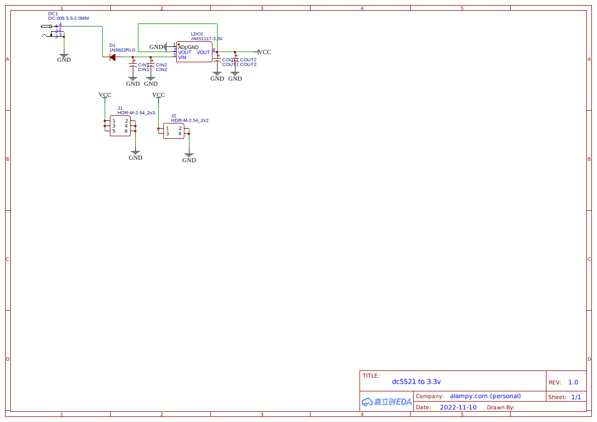

***Only Chinese document is available.***

# SMARTCLK
-brightgreen)  
基于ESP-IDF框架的互联网时钟，支持时间显示、整点报时、可重复闹钟、天气播报、网络授时。  

## 仓库结构
- [`/docs`](/docs)：文档
- [`/eda`](/eda)：嘉立创EDA（标准版）工程文件
- [`/main`](/main)：软件主代码
- [`/components`](/components)：软件所依赖的组件

## 电路实物图

## 软件使用说明
用户可通过MODE按键在多个模式间切换，以查看/修改不同的内容。本产品主要包括以下模式：
### 主页模式（时间显示模式）
长按SET建进入时间设置  
### 天气模式
可查看7日天气，长按SET键刷新  
### 闹钟/报时列表
可查看闹钟信息，EN表示启用，DD表示禁用，短按SET键进行启用/禁用切换，长按SET键进行编辑。  
在最后一页长按SET键进入“添加闹钟”模式，闹钟分为两类：定时闹钟、报时闹钟。  
报时闹钟为在每小时开始时进行语音播报“现在是xx点整”，可配置只在特定的时段播报。  
定时闹钟为在某一指定时刻播报，可按日重复，可选择只在特定的“周天”启用，如只在周一~周五启用，有最多255种铃声可选（可自定义铃声，铃声需以MP3格式拷贝到SD卡上的指定位置，并以指定格式命名）。  
定时闹钟中存在一种特殊铃声：“0:Weather”，该铃声表示在闹钟触发时将语音播报当日的天气情况“今天天气xx，白天气温x摄氏度，夜间气温x摄氏度”。  
### 计时模式（秒表模式）
按SET键重置为0，按UP/DOWN键暂停/恢复。  
### WiFi设置模式
可显示已配置的网络SSID，长按SET键进入配置模式。  
采用通用的ESP-TOUCH (Smart Config)协议进行配网操作，进入配网模式后可使用“一键配网”等微信小程序进行WiFi信息广播，以完成配网。  
### NTP网络授时设定
短按SET键可触发立即同步，长按SET键进入配置模式，可配置是否启用定时同步和时区信息。  

## 软件架构图

## 电路图预览
**仅供参考，最新电路图请以EDA工程文件为准**  

  
  
*(Updated at 2022-12-04)*  

## 硬件物料表
| 名称 | 数量 |
| :--- | ---: |
| ESP32-DevKitM-1开发板 | 1 |
| MP3-TF-16P模块 | 1 |
| 0.96寸OLED显示液晶屏模块 7P（SSD1306驱动芯片，SPI通讯协议） | 1 |
| RX8025T-UB芯片 | 1 |
| 1N5822二极管 | 1 |
| AMS1117-3.3V芯片 | 1 |
| 4.7kΩ直插电阻 | 2 |
| 1μF直插电解电容 | 3 |
| 22μF直插电解电容 | 2 |
| 2.54mm 2P排母 | 2 |
| 2.54mm 3P排母 | 2 |
| 2.54mm 7P排母 | 1 |
| 2.54mm 8P排母 | 2 |
| 2.54mm 17P排母 | 4 |
| 2.54mm 2P排针 | 2 |
| 2.54mm 3P排针 | 2 |
| 2308圆形插针式8欧1W语音扬声器 | 1 |
| 9042一体无源交流蜂鸣器 | 1 |
| 6\*6\*5mm立式4P按键按钮 | 4 |
| DC-099电源插座 | 1 |
| PJ-3135-B 3.5mm耳机座 5P | 1 |
| 按键帽（可选） | 4 |
| 9V电池扣-DC电源插头（可选） | 1 |